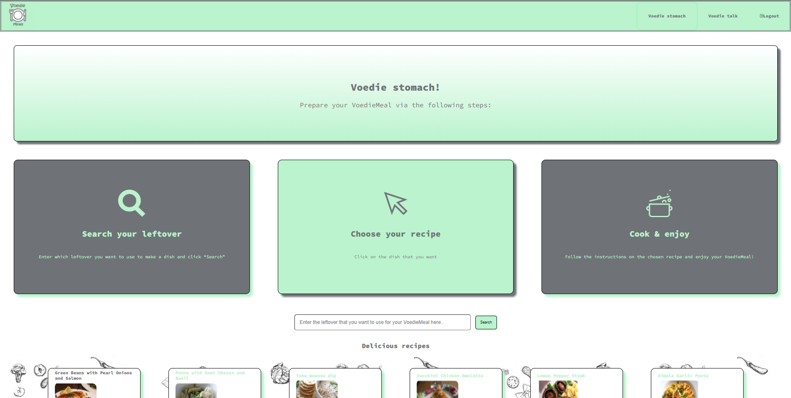
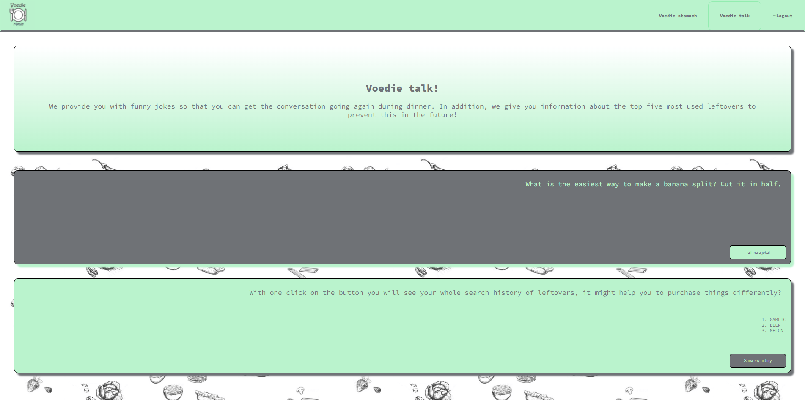
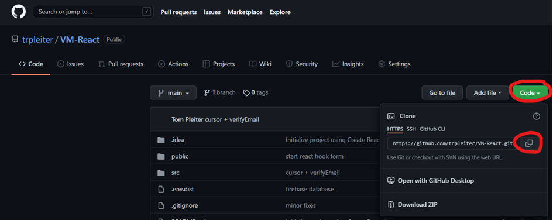
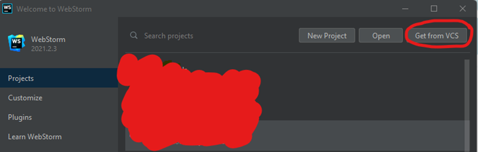
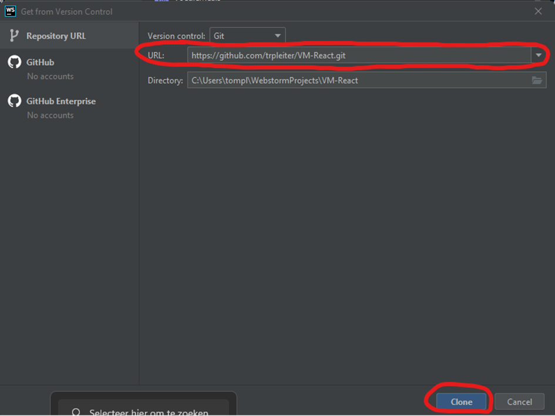
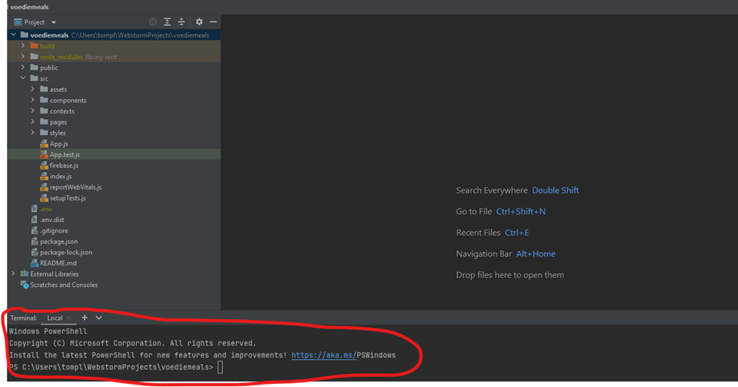
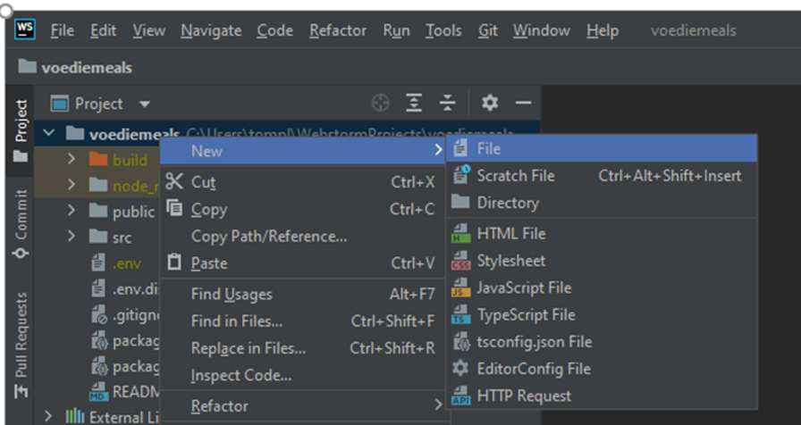

# Welkom bij de VoedieMeals webapplicatie!

Met behulp van VoedieMeals wordt er op een positieve en leuke manier inzicht gegeven aan de gebruiker welke gekochte
voedingsmiddelen regelmatig overblijven als restantjes. De webapplicatie zal deels als informatieve bron fungeren door
het doorsturen naar sites waar meer informatie is rondom het effect van voeding op het klimaat. Daarnaast heeft de
webapplicatie interactieve aspecten. Allereerst kan de gebruiker restantjes in te vullen in de webapplicatie. Vervolgens
komen er gerechten naar voren waar deze restantjes als ingrediënten worden gebruikt. Tegelijkertijd wordt in de database
opgeslagen welke restanten zijn ingevuld (account vereist). 

*Schermafdruk Voedie stomach pagina*

Bij langdurig gebruik van de app wordt inzichtelijk gemaakt
welke voedingsmiddelen tot de restanten behoren om de gebruiker de optie te geven om zijn of haar koopgedrag aan te
passen. Om van VoedieMeals een iets luchtiger concept te maken wordt er ook een tweede interactief aspect toegevoegd,
namelijk een generator voor willekeurige voedingsfeitjes of voedingsgrappen. 

*Schermafdruk Voedie talk pagina*

Met deze opzet wordt er ongegeneerd, gezellig en heerlijk gegeten.

## Installatiehandleiding VoedieMeals

Om de gemaakte applicatie “VoedieMeals” vanaf een gloednieuwe computer of als leek te draaien moeten een aantal dingen
gerealiseerd worden. Allereerst is er een IDE (Integrated Development Environment) nodig. Dit is een editor/programma
waarin code eenvoudiger kan worden geschreven. Het zou technisch gezien ook in een tekst-bestand kunnen worden
geschreven, maar dat zal voor veel meer problemen gaan zorgen. WebStorm en Visual Studio Code zij voorbeelden van
IDE’s. In deze handleiding wordt gebruik gemaakt van WebStorm. WebStorm is een product van JetBrains, om het product te
kunnen gebruiken moet het worden gedownload via https://www.jetbrains.com/webstorm/. Volg de stappen voor de installatie
van WebStorm die worden weergegeven.

### Git

Wanneer WebStorm succesvol geïnstalleerd is, kan er aan nieuwe projecten worden begonnen, maar er kunnen ook bestaande
projecten worden binnengehaald om daar vervolgens op voort te borduren. In dit geval wordt de applicatie “VoedieMeals”
opgehaald. Dit kan op verschillende manieren, namelijk door een gedownload bestand van het project te openen, of door
het project van een Version Control System (VCS) op te halen, Git is hier een opensource voorbeeld van. In deze
handleiding wordt het project van GitHub afgehaald. GitHub is niet hetzelfde als Git, een korte en simpele uitleg van
GitHub is dat het een website is waar programmeurs hun projecten op een centrale plek beheren met Git. VoedieMeals is op
te halen via de volgende link: https://github.com/trpleiter/VM-React

Wanneer de genoemde link is geopend, kan het project worden gekopieerd door op de groene “Code” knop te klikken en
vervolgens op de “copy” knop achter de HTTPS-link (zie Afbeelding 1).

*Afbeelding 1*

Vervolgens kan bij het openen van WebStorm de gekopieerde link worden ingevoerd om de code voor de applicatie
“VoedieMeals” op te halen. Hiervoor dient op “Get from VCS” te worden geklikt (zie Afbeelding 2). Daarna moet de van
GitHub gekopieerde link in het veld “URL” worden geplaats. Ten slotte dient op “Clone” te worden geklikt (zie Afbeelding
3). Hierna wordt de code opgehaald in de IDE.

*Afbeelding 2*

*Afbeelding 3*

### Node.js

Om de applicatie te kunnen ‘runnen’ is Node.js nodig. Wat Node.js allemaal precies is, is niet heel relevant om te weten
om de applicatie te kunnen draaien. Het belangrijkste wat het doet is dat het een runtine omgeving verzorgd en dat er
gebruik kan worden gemaakt van packages door middel van Node Package Manager (NPM). Packages vereenvoudigen code door al
bestaande code te kunnen toevoegen in de eigen te schrijven code. Hierdoor hoeft niet telkens opnieuw het wiel te worden
uitgevonden.

Installeer Node.js via de volgende link: https://nodejs.org/en/download/. Wanneer dit klaar is moet de terminal worden
gewerkt. In afbeelding 4 staat weergegeven waar de terminal zich bevindt.

*Afbeelding 4*

Typ hier:

### `node -v`

Als Node.js aanwezig is, wordt een versienummer weergegeven. Typ vervolgens:

### `npm -v`

Als NPM aanwezig is, wordt een versienummer weergegeven.

## Environment variables

Voordat we de applicatie gaan runnen dienen de environment variables eerst te worden toegevoegd. Dit zijn variabelen die
in feite geheim moeten blijven, daarom worden deze niet opgehaald van GitHub. Voeg daarom een file toe aan de hoofdmap
voediemeals -> New -> File (zie Afbeelding 5).

*Afbeelding 5*

Noem de nieuwe file “.env” zoals die als in afbeelding … staat. Plak hier de volgende tekst in:
REACT_APP_API_KEY=

REACT_APP_FIREBASE_API_KEY=

REACT_APP_FIREBASE_AUTH_DOMAIN=

REACT_APP_FIREBASE_PROJECT_ID=

REACT_APP_FIREBASE_STORAGE_BUCKET=

REACT_APP_FIREBASE_MESSAGING_SENDER_ID=

REACT_APP_FIREBASE_APP_ID=

EMAIL voor Firebase=

WACHTWOORD voor Firebase=

Typ vervolgens weer in de terminal “npm run build”. Typ als allerlaastste stap “npm run start” en de applicatie zal in
de browser tevoorschijn komen op [http://localhost:3000](http://localhost:3000).

### Vanaf dit punt kun je genieten van VoedieMeals!

Er kan zelfstanding een account worden aangemaakt, maar het account voediemeals@gmail.com met wachtwoord: “...” bestaat
al.

